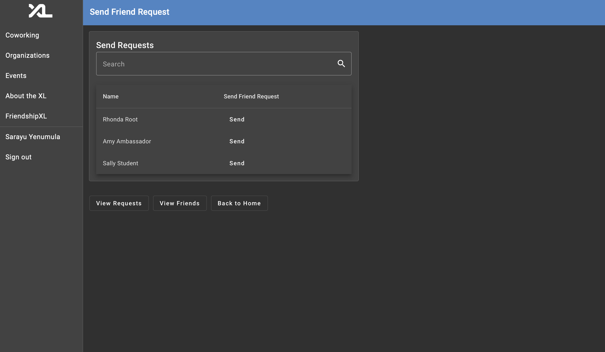
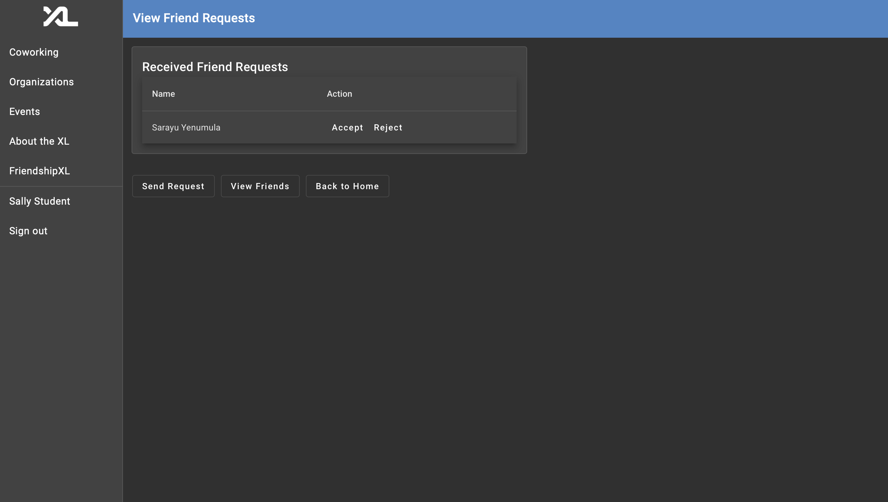
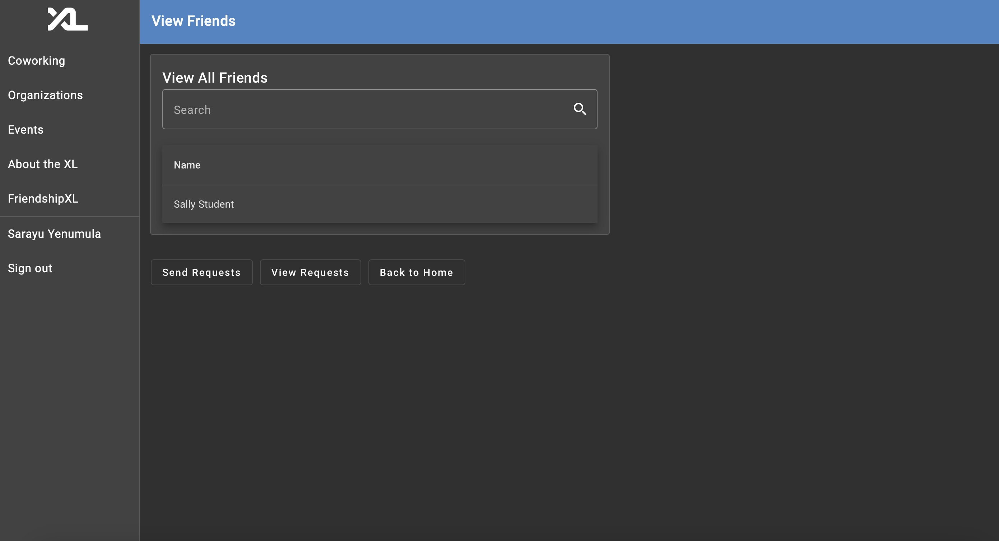
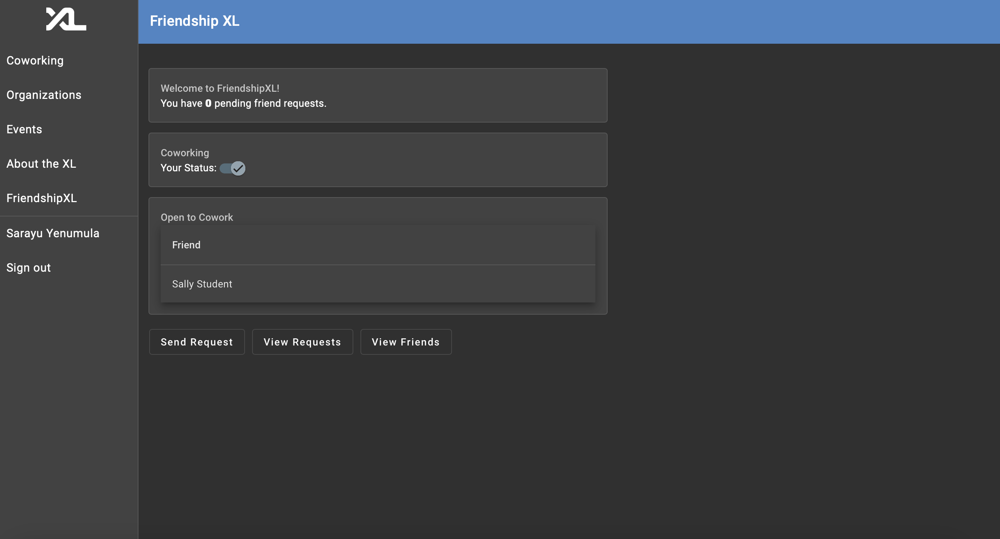

# FriendshipXL Technical Specification

**Authors**

- Arya Rao: https://github.com/avrao2
- Tanvi Pulipaka: https://github.com/tanvip9
- Srinidhi Ekkurthi: https://github.com/srinidhiekk
- Sarayu Yenumula: https://github.com/sarayuyen3

## Document Overview

This document outlines the technical specifications for the send, accept, and reject requests developed in Sprint 1. It also highlights the coworking feature implemented in Sprint 2. The document includes explanations of model representations, API routes, database representation decisions, design choices, and a guide of how to get started on the feature.

## Stories

Our first story's goal was to allow a registered user to send a request to another registered user within the database, not including themselves or other users that they have a request status with.

Here, you can see that Sarayu Yenumula is able to send a request to the following users. Sarayu Yenumula chooses to send a friend request to Sally Student.

Following this, our second friendship feature was to implement functionality that enables users to accept and deny friend requests sent to them. There are three dedicated pages on the FriendshipXL section of the CSXL: Send Request, View Requests, and View Friends.

Sally Student is able to either accept or reject the friend request received. Sally Student accepts the friend request.

Sarayu Yenumula can now see Sally Student as their friend.

Finally, as an additional feature, we implemented a coworking status that users can toggle based on whether they are willing to cowork with their friends in the CSXL.

Because Sally Student is Sarayu Yenumula's friend, Sarayu Yenumula is able to see that Sally Student is open to cowork. Sally Student indicated this preference through the toggle.

## Model Representation

In the frontend, we created two new models: User and FriendRequest. These were then utilized when sending and responding to a friend request, as well as viewing a user's friends. The following fields are included in the User model: id, pid, onyen, first name, last name, email, pronouns, github, github id, github avatar, permissions, and is coworking. These all reflect attributes identifying a user. The FriendRequest model contains these fields as well, with the exception of the permissions and is coworking fields.

Moreover, we modified the existing User backend model and Profile frontend model to include a boolean field that indiciates a user's coworking status.

## API Routes

| Name                               | Route                                                       | Description                                                                             |
| ---------------------------------- | ----------------------------------------------------------- | --------------------------------------------------------------------------------------- |
| List Users                         | `GET /api/friendships/users`                                | Lists all eligible users to send a friend request to                                    |
| Send Friend Request                | `POST /api/friendships/send-request/{receiver_id}`          | Allows a user to send a friend request to another user with the specified `receiver_id` |
| Get Received Friend Requests       | `GET /api/friendships/requests/received`                    | Gets all received friend requests for the authenticated user                            |
| Get Received Friend Requests Count | `GET /api/friendships/requests/received/count`              | Gets the count of pending friend requests for the authenticated user                    |
| Accept Friend Request              | `PUT /api/friendships/accept/{request_id}`                  | Allows a user to accept a friend request with the specified `request_id`                |
| Reject Friend Request              | `PUT /api/friendships/reject/{request_id}`                  | Allows a user to reject a friend request with the specified `request_id`                |
| Get Friends                        | `GET /api/friendships/friends`                              | Gets all friends for the authenticated user                                             |
| Update Coworking Status            | `PUT /api/friendships/update-coworking/${user_pid}`         | Updates a user's coworking status                                                       |
| Get Friends Coworking Status       | `GET /api/friendships/friends-coworking-status/${user_pid}` | Gets the coworking status of a user's friends                                           |

## Database/Entity-Level Representation Decisions

We introduced a FriendshipEntity to store relationships between users, keeping track of friend requests sent and received. Within this entity, we included the following fields:

| Field         | Description                                                |
| ------------- | ---------------------------------------------------------- |
| id            | Unique ID for the friendship entry                         |
| sender        | User ID of sender                                          |
| reciever      | User ID of receiver                                        |
| status        | Can represent a sent, accepted, or rejected friend request |
| sender_user   | Relationship back to UserEntity for sender                 |
| receiver_user | Relationship back to UserEntity for receiver               |

## Design Choices

### Technical Design Choice

We created a FriendshipEntity in order to easily keep track of friendship request relationships between registered users. We created a new table in the SQLAlchemy Database that keeps track of a relationship between two users, whether that be requested, accepted, or rejected. This was the most appealing approach to us as using foreign key relationships in the FriendshipEntity table clearly defines user relationships. Furthermore, having friendship-related data separate makes the codebase more organized, maintainable, and easier to query. As developers, it provides a solid visualization to better navigate challenges throughout the development process.

### User Experience Design Choice

In the user interface, we initially implemented our own overall web styling and layout. However, we made the decision to produce a feature that is coherent with the existing CSXL UI. In order to do this, we used the mat table, mat card, mat button, etc. This created a much cleaner appearance that conveys our feature as an extension of the CSXL.

## Development Concerns: Getting Started

For new developers joining the project to work on the Friendship XL feature, follow these steps to get up to speed:

1. Clone the project repository.
2. Install the required dependencies using `pip install -r requirements.txt`.
3. Download the PostgreSQL Explorer extension and connect to the database using the following settings:
   - Hostname: db
   - Username: postgres
   - Password: postgres
   - Port: 5432
   - Connection: Standard
   - Database: csxl
   - Display Name: db
4. Run both the user and friendships tables to familiarize yourself with the attributes used throughout the code. Navigate to `backend/entities/friendship_entity.py` to understand what each attribute represents and `backend/services/friendship.py` to grasp how the Friendship Entity is implemented in the service functions.
5. Navigate to `backend/api/friendship.py` and review the API routes thoroughly to understand each one's purpose, input, output, and error handling. Based on this information, you can use the FastAPI at `localhost:1560/docs` to visualize input and output. Run the project locally using `honcho start` in order to access FastAPI. Ensure that you are authorized as a specific user in the database. You can get this authentication with a bearer key found in the application tab of the developer's console on the local host.
6. Within `frontend/src/app/friends` you will find the `friendship.service.ts` file. Go through each method to gain an understanding of how the frontend and backend are connected. You might notice the use of "User" and "FriendRequest" throughout these files. These are models that have been created and can be referenced within the `friends` folder as well.
7. Review the rest of the frontend code found in `frontend/src/app/friends`. You will see a `friendship-home` folder. This includes all of the information on the landing page when you click FriendshipXL on the CSXL website sidebar. Read through the html and ts files to view coworking information and pending friend requests.
8. Navigate to the `requests` folder and go through the three sub-folders: send requests, view requests, and view friends. It is important to have an understanding of how each page is initialized and users are loaded and dynamically updated. To do so, you should read through the methods in the ts files.
9. Test the new feature thoroughly on the `localhost:1560` port. Authorize as multiple users and send, accept, and reject friend requests to see the code in action. You can also toggle the coworking status and view how this change reflects on your friends' pages.
